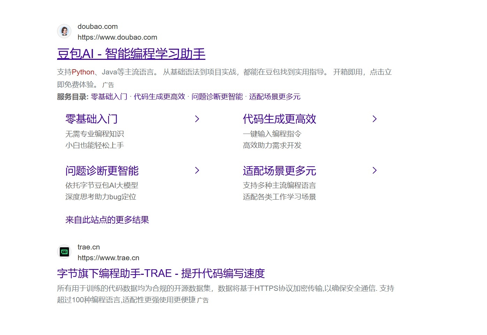
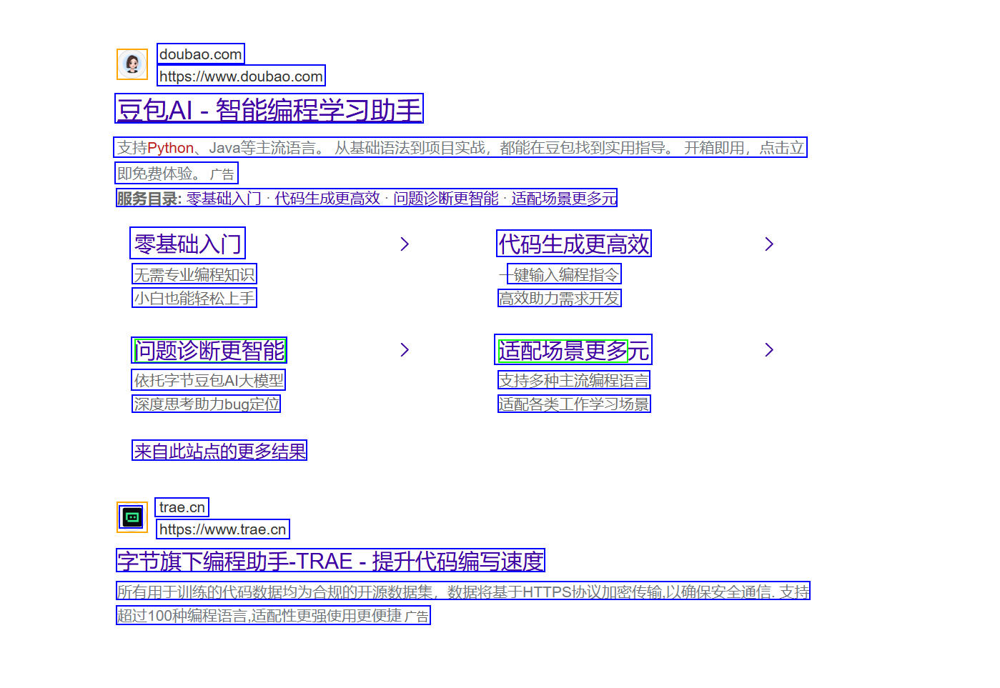
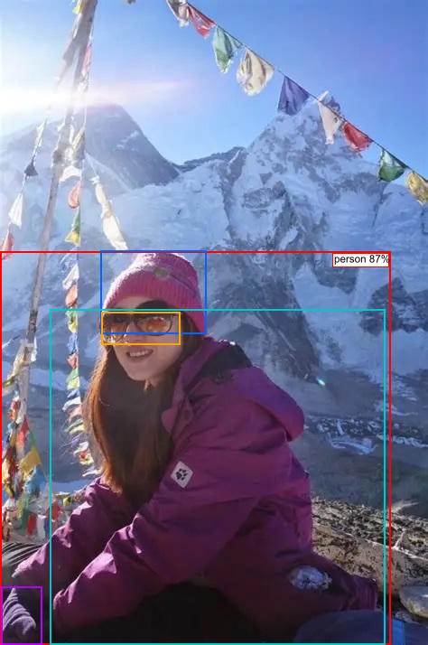
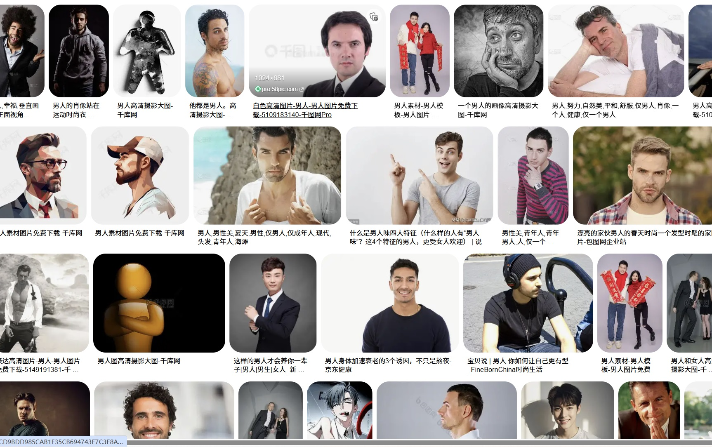
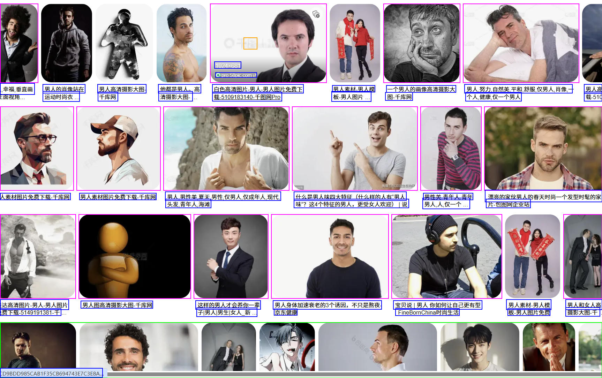
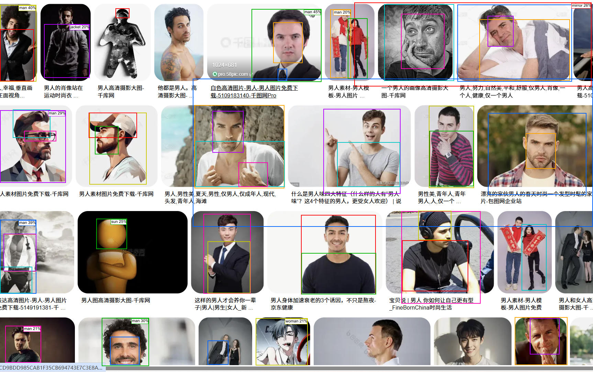

<h1 align="center">quasivision</h1>

<p align="center">
  <a href="https://github.com/WeiChens/quasivision/stargazers"></a>
  <a href="https://github.com/WeiChens/quasivision/network/members"></a>
  <a href="https://github.com/WeiChens/quasivision/issues"></a>
  <a href="https://github.com/WeiChens/quasivision/blob/main/LICENSE"></a>
</p>

<p align="center">
  <a href="README.md">🇬🇧 English</a> · <a href="README-zh.md">🇨🇳 中文</a>
</p>

基于 Rust 的伪视觉理解工具。  
可处理截图、UI 设计稿、真实世界照片等多类输入 —— 自动检测 UI 组件（按钮、文本框、图标、图片等），通过 OCR 识别文字内容，利用 YOLOE-26n 识别 860 类日常物体（人、车、手机、食物等），分类 81 种常见 Icon 含义，并输出结构化描述与可视化标注。

---

## 📋 目录

1. [快速开始](#快速开始)
2. [效果展示](#效果展示)
3. [输出内容说明](#输出内容说明)
4. [命令行参数详解](#命令行参数详解)
5. [输出文件一览](#输出文件一览)
6. [检测流程](#检测流程)
7. [核心功能](#核心功能)
8. [常见问题](#常见问题)
9. [实用示例](#实用示例)

---

## 🚀 快速开始 <a id="快速开始"></a>

### 基本用法

```bash
# 单图检测
cargo run -- --input 图片.png

# 试试内置的演示图片
cargo run -- --input demo/ui.jpg

# 指定输出目录
cargo run -- --input 图片.png --output ./result

# 批量处理目录中所有图片
cargo run -- --input ./screenshots/

# 递归处理子目录
cargo run -- --input ./screenshots/ --recursive
```

### 最简示例

```bash
cargo run -- --input demo/ui.jpg
```

输出到 `./output/ui/` 目录下，包含检测结果文件。

---

## 🖼️ 效果展示 <a id="效果展示"></a>

### 1. UI 检测 — 网页搜索结果页

|        输入原图         |                    检测结果                    |
| :---------------------: | :--------------------------------------------: |
|  |  |

从搜索结果页面中检测出文本、图标、按钮等 UI 组件，并提取完整 OCR 文字内容。

### 2. 物体检测 — 真实世界照片

|             输入原图              |                      检测结果                      |
| :-------------------------------: | :------------------------------------------------: |
|  |  |

检测到 6 个物体及其层级关系（person → cap/hat/glasses/glove/jacket），带置信度标注。

**检测结果：**

```
Objects (474×714) — 6 found:
└─ [  0,278 433×436] person (87%)
   ├─ [111,277 118× 93] cap (39%)
   │  └─ [111,277 118× 93] hat (82%)
   │     └─ [112,345  88× 38] glasses (65%)
   ├─ [  1,649  46× 65] glove (21%)
   └─ [ 55,342 373×372] jacket (20%)
```

### 3. 混合场景 — 图库页面

|              输入原图              |                      UI 检测结果                       |                    物体检测结果                    |
| :--------------------------------: | :----------------------------------------------------: | :------------------------------------------------: |
|  |  |  |

图库类页面：UI 检测提取布局结构（图片网格、导航栏、文字标签），物体检测识别照片中的人物等主体。

---

## 📤 输出内容说明 <a id="输出内容说明"></a>

### 输出格式（固定为 `tree`）

输出始终为 **`tree` 格式**（无需 `--format` 参数）：

```
tree        树形嵌套结构，同时输出 JSON + 纯文本，AI 一眼看懂 DOM 层级
```

同时输出 `elements.tree.json`（JSON 树）和 `elements.tree.txt`（纯文本树）。

### 输出文件列表

| 文件                                   | 来源        | 说明                                                |
| -------------------------------------- | ----------- | --------------------------------------------------- |
| `elements.tree.json`                   | UI 元素检测 | 检测到的所有 UI 组件（按钮/文本/图标/Block 等）     |
| `elements.tree.txt`                    | UI 元素检测 | 纯文本格式摘要                                      |
| `visualization.jpg`                    | UI 元素检测 | 可视化标注图（各组件用不同颜色边框标记）            |
| `objects.tree.json`                    | 物体检测    | YOLOE 检测的物体（人/车/手机等 860 类），含父子层级 |
| `objects.tree.txt`                     | 物体检测    | 物体检测纯文本格式                                  |
| `objects.jpg`                          | 物体检测    | 物体检测可视化标注图（带标签）                      |

---

## ⚙️ 命令行参数详解 <a id="命令行参数详解"></a>

### 基础参数

| 参数           | 类型   | 默认值              | 说明                                                      |
| -------------- | ------ | ------------------- | --------------------------------------------------------- |
| `-i, --input`  | String | **必填**            | 输入图片路径或目录                                        |
| `-o, --output` | String | `output`            | 输出根目录                                                |
| `--recursive`  | bool   | `false`             | 递归处理子目录中的图片                                    |
| `--extensions` | String | `png,jpg,jpeg,jfif` | 图片扩展名过滤（逗号分隔）                                |

### UI 检测参数

| 参数                | 类型 | 默认值  | 说明                                   |
| ------------------- | ---- | ------- | -------------------------------------- |
| `--gradient`        | u8   | `4`     | 梯度阈值（dribbble/rico: 4, web: 1）   |
| `--min-area`        | u32  | `55`    | 最小连通区域面积                       |
| `--paragraph`       | bool | `false` | 是否启用段落合并                       |
| `--remove-bar`      | bool | `true`  | 是否移除顶栏/底栏                      |
| `--sub-component`   | bool | `true`  | 是否启用子组件检测（图片内部按钮检测） |
| `--synthesize-text` | bool | `true`  | 是否为孤儿文本自动合成容器 Block       |

### 线条 / 矩形参数

| 参数                | 类型 | 默认值 | 说明                                         |
| ------------------- | ---- | ------ | -------------------------------------------- |
| `--line-thickness`  | u32  | `8`    | 线条最大粗细（像素）                         |
| `--line-min-length` | f64  | `0.95` | 线条最小长度比例                             |
| `--rec-evenness`    | f64  | `0.7`  | 矩形最小平整度                               |
| `--rec-dent`        | f64  | `0.25` | 矩形最大凹陷比                               |
| `--rec-corner-skip` | f64  | `0.08` | 圆角容错（0=严格直角，0.08~0.12=识别大圆角） |

### Block 检测参数

| 参数           | 类型 | 默认值 | 说明                   |
| -------------- | ---- | ------ | ---------------------- |
| `--block-side` | f64  | `0.15` | Block 边长占比阈值     |
| `--block-grad` | u8   | `5`    | Block 嵌套检测梯度阈值 |

### 文本参数

| 参数           | 类型 | 默认值 | 说明                           |
| -------------- | ---- | ------ | ------------------------------ |
| `--text-max-h` | f64  | `0.08` | 文本最大高度比（相对图片高度） |
| `--text-gap`   | u32  | `10`   | 文本单词最大间距（像素）       |
| `--ocr`        | bool | `true` | 是否启用 OCR 文字识别          |

### Icon / 物体检测参数

| 参数              | 类型   | 默认值                                                  | 说明                      |
| ----------------- | ------ | ------------------------------------------------------- | ------------------------- |
| `--icon-classify` | bool   | `true`                                                  | 是否启用 Icon 含义识别    |
| `--object-detect` | bool   | `true`                                                  | 是否启用物体检测          |
| `--detect-model`  | String | `resources/object-detection/yoloe-26n-seg-dynamic.onnx` | YOLOE 模型路径            |
| `--detect-labels` | String | `resources/object-detection/yoloe-26n_classes.txt`      | YOLOE 标签文件路径        |
| `--detect-conf`   | f32    | `0.2`                                                   | 物体检测置信度阈值（0~1） |
| `--models-dir`    | String | `resources`                                             | 模型资源根目录            |

### 关闭特定功能

```bash
# 关闭 OCR（仅做 UI 结构检测，不识别文字）
cargo run -- --input 图片.png --ocr false

# 关闭物体检测
cargo run -- --input 图片.png --object-detect false

# 关闭 Icon 含义识别
cargo run -- --input 图片.png --icon-classify false

# 仅做 UI 检测（全部可选功能关闭）
cargo run -- --input 图片.png --ocr false --object-detect false --icon-classify false
```

---

## 📁 输出文件一览 <a id="输出文件一览"></a>

### 单张图片的输出目录结构

```
output/
└── 图片名/                  # 以图片文件名（不含扩展名）命名
    ├── elements.tree.json   # UI 元素树（JSON 格式）
    ├── elements.tree.txt    # UI 元素树（文本格式）
    ├── visualization.jpg    # UI 检测可视化图
    ├── objects.tree.json    # 物体检测树（JSON 格式）
    ├── objects.tree.txt     # 物体检测树（文本格式）
    └── objects.jpg          # 物体检测可视化图
```

> 注意：`objects.*` 文件仅在 `--object-detect true` 且检测到物体时生成。

---

## 🔄 检测流程 <a id="检测流程"></a>

```
输入图片
  │
  ├─ 1. 预处理 ─────────── 灰度化、去线条、去背景
  │
  ├─ 2. 连通区域检测 ───── 梯度计算 → CCL 连通域
  │
  ├─ 3. 矩形/线条检测 ──── 识别按钮、输入框等规则形状
  │
  ├─ 4. 合并过滤 ───────── 合并重叠区域、过滤噪声
  │
  ├─ 5. 规则分类 ───────── Block / Button / Text / Icon / Image
  │      │
  │      ├─ Icon 分类器 ── 81 类常见 Icon 含义（ONNX Runtime）
  │      │
  │      └─ OCR（后台） ── 文本识别（PaddleOCR 模型）
  │
  ├─ 6. 合并 ───────────── OCR 文本合并到 UI 元素
  │
  ├─ 7. 颜色检测 ───────── 提取各元素的背景/前景色
  │
  └─ 8. 输出 ───────────── 5 种格式 + 可视化标注
```

### 并行执行

物体检测（YOLOE-26n）和 OCR 在**后台线程**中与主流程并行执行，不增加额外等待时间。

---

## 🧩 核心功能 <a id="核心功能"></a>

### 1. UI 元素检测（主体功能）

检测 7 类 UI 元素：

| 类别          | 说明                               |
| ------------- | ---------------------------------- |
| **Block**     | 容器区块（卡片、列表项、导航栏等） |
| **Button**    | 可点击按钮                         |
| **Text**      | 文字标签                           |
| **Icon**      | 图标（小尺寸方形元素）             |
| **Image**     | 图片                               |
| **Input**     | 输入框                             |
| **List Item** | 列表项（带勾选标记）               |

### 2. OCR 文字识别

- 基于 PaddleOCR 模型（PP-OCRv5）
- Windows 平台支持 DirectML GPU 加速
- 自动检测图片中的文字内容
- 大文本保护：有意义的较长文字（>5 字符）不受高度限制过滤

### 3. 物体检测（YOLOE-26n）

- 基于 ONNX Runtime 的 YOLOE-26n 模型（动态输入，端到端 NMS）
- 860 类常见物体识别（人、车、手机、食物、动物等）
- 自动构建父子包含关系树
- 输出可视化标注图 `objects.jpg`
- 模型体积相比上一代 YOLO-World **减少 77%**（11.1 MB vs 49.5 MB）

### 4. Icon 含义识别

- 基于 ONNX 模型的 81 类 Icon 分类
- 常见 UI Icon 含义识别（设置、搜索、分享、返回等）
- 置信度 > 40% 显示候选含义

### 5. 颜色检测

- 自动提取各元素的背景/前景色
- 输出十六进制颜色值

---

## ❓ 常见问题 <a id="常见问题"></a>

### Q: 模型文件从哪里获取？

模型文件位于 `resources/` 目录下：

```
resources/
├── ocr-models/
│   ├── ppocrv5_mobile_det.onnx   # OCR 检测模型
│   ├── ppocrv5_mobile_rec.onnx   # OCR 识别模型
│   └── ppocrv5_dict.txt          # 中文字典
├── icon-classifier/
│   ├── icon_classifier.onnx      # Icon 分类模型
│   └── labels.json               # 81 类标签
└── object-detection/
    ├── yoloe-26n-seg-dynamic.onnx # YOLOE-26n 物体检测模型（11 MB）
    └── yoloe-26n_classes.txt     # 860 类标签
```

### Q: 输出结果坐标是多少？

输出使用原始图片像素坐标（tree 格式）：

```json
{
  "column_min": 100, // 左上角 x
  "row_min": 200, // 左上角 y
  "column_max": 300, // 右下角 x
  "row_max": 400 // 右下角 y
}
```

所有坐标均为原始像素值（不提供 0-1000 归一化）。

### Q: 如何只检测物体（不做 UI 检测）？

当前设计为全流水线运行，无法单独运行物体检测。可以通过设置 `--ocr false --icon-classify false` 关闭附属功能。

### Q: 如何提高检测质量？

- **梯度阈值**：网页截图用 `--gradient 1`，App 截图用 `--gradient 4`
- **圆角识别**：大圆角元素用 `--rec-corner-skip 0.12`
- **文本识别**：小字体用 `--text-max-h 0.12` 提高文本高度上限

### Q: 置信度阈值调多少合适？

| 场景                         | `--detect-conf` 建议值 |
| ---------------------------- | :--------------------: |
| 只想看到高置信度物体         |          0.5           |
| 平衡查准率和查全率           |      0.2（默认）       |
| 尽量多地检测物体（容忍误检） |          0.1           |

### Q: 支持的图片格式？

默认支持 `png`、`jpg`、`jpeg`、`jfif`。可通过 `--extensions` 自定义。

---

## 💡 实用示例 <a id="实用示例"></a>

```bash
# App 截图检测（推荐参数）
cargo run -- -i app.png --gradient 4

# Web 页面检测
cargo run -- -i webpage.png --gradient 1 --rec-corner-skip 0.1

# 批量处理 + 递归子目录
cargo run -- -i ./screenshots/ --recursive

# AI 友好输出 + 关闭不必要的功能
cargo run -- -i ui.png --icon-classify false

# 高精度检测（调低阈值，更多物体）
cargo run -- -i photo.jpg --detect-conf 0.1

# 带段落合并的文本检测
cargo run -- -i document.png --paragraph true --text-max-h 0.15
```

---

> **项目地址**：`E:/code/quasivision`  
> **Cargo 运行**：确保在项目根目录下执行 `cargo run -- ...`

## License

- **源代码**: MIT © quasivision
- **PP-OCRv5**: Apache 2.0 © PaddlePaddle
- **YOLOE-26n-seg**: AGPL-3.0 © Ultralytics
- **Icon Classifier**: MIT
